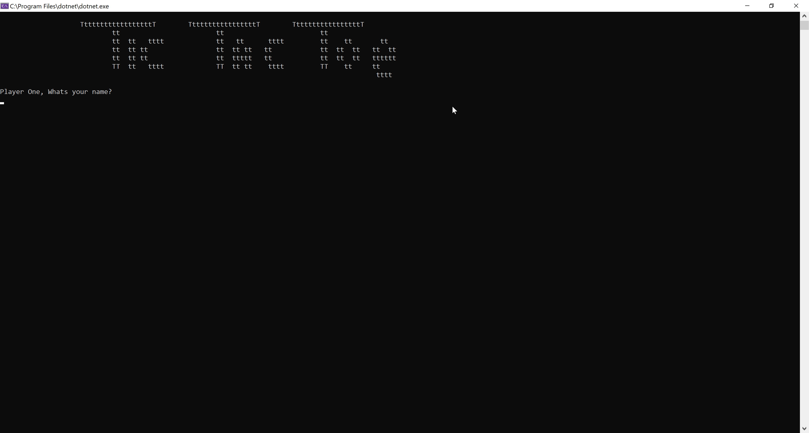
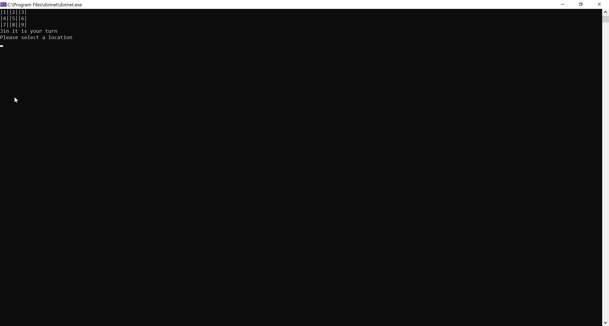
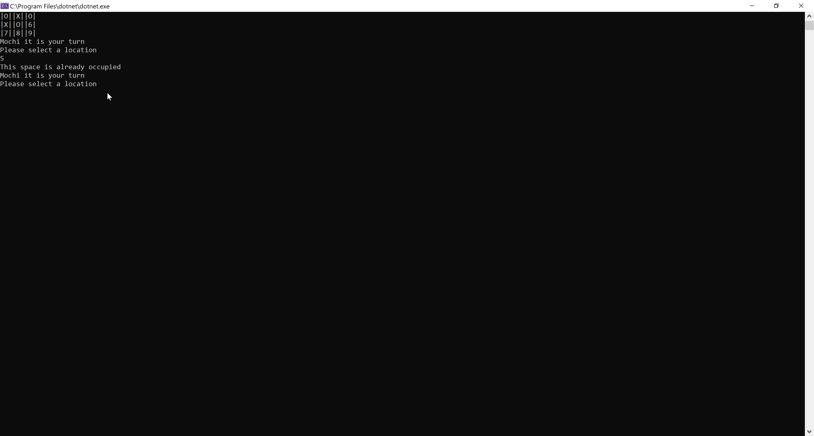
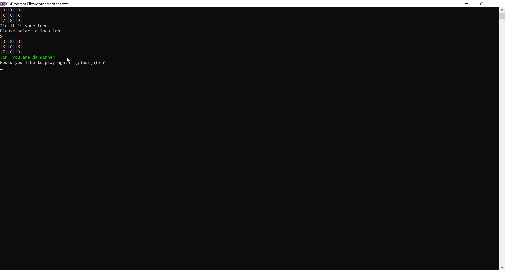
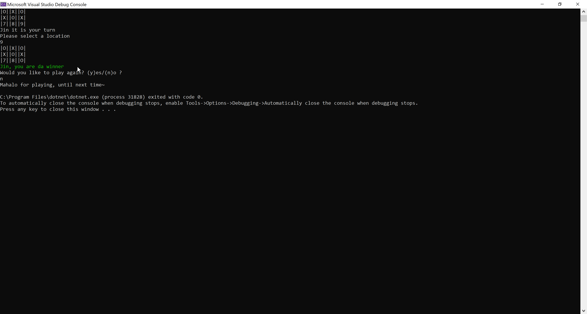

# Tic Tac Toe Game Application


Lab04 - Classes & Objects

*Author: Jin Kim*

----

## Description

This is two player C# console gaming application that allows user to play classic game of "Tic Tac Toe". Each user will be prompt for their name and each maticulous seletion will result yield ramification at end.

---
## Dependencies

- [Git](https://git-scm.com/)
- Terminal/ Command line
- [.Net Core SDK](https://dotnet.microsoft.com/download)
- [Visual Studio](https://docs.microsoft.com/en-us/visualstudio/releases/2019/release-notes)

---
### Getting Started
Clone this repository to your local machine using terminal(macOS), command line(Window).

```
$ git clone [repo clone url here]
```

### To run the program from Visual Studio:
Select ```File``` -> ```Open``` -> ```Project/Solution```

Next navigate to the location you cloned the Repository.

Double click on the ```Lab04_TicTacToe``` directory.

In the `Lab04_TicTacToe`, navigate further into `Lab04_TicTacToe`

Then select and open ```Lab04_TicTacToe.sln```

### To Run the program from Command Line/ Terminal
After clonning the file, navigate to `LLab04_TicTacToe`

Navigate further into `Lab04_TicTacToe` ->`Lab04_TicTacToe`

Type in `dotnet run` and console will prompt you with options.

---

### Visuals

#### Application Start


#### User choosing tile


#### When space is already picked


#### Winner Screem


#### Application End


---

### Change Log
1.3: *Added functationality to restart the application and try finally block to the main method to create more interactive appliation* - March 22 2020  
1.2: *Implemented tests to check everything passes* - March 22 2020  
1.1: *Created methods to connect each classes and make sure method checks if array index is already chose* - March 22 2020  
1.0: *Created Repo, structuralized the application* - March 22 2020  
